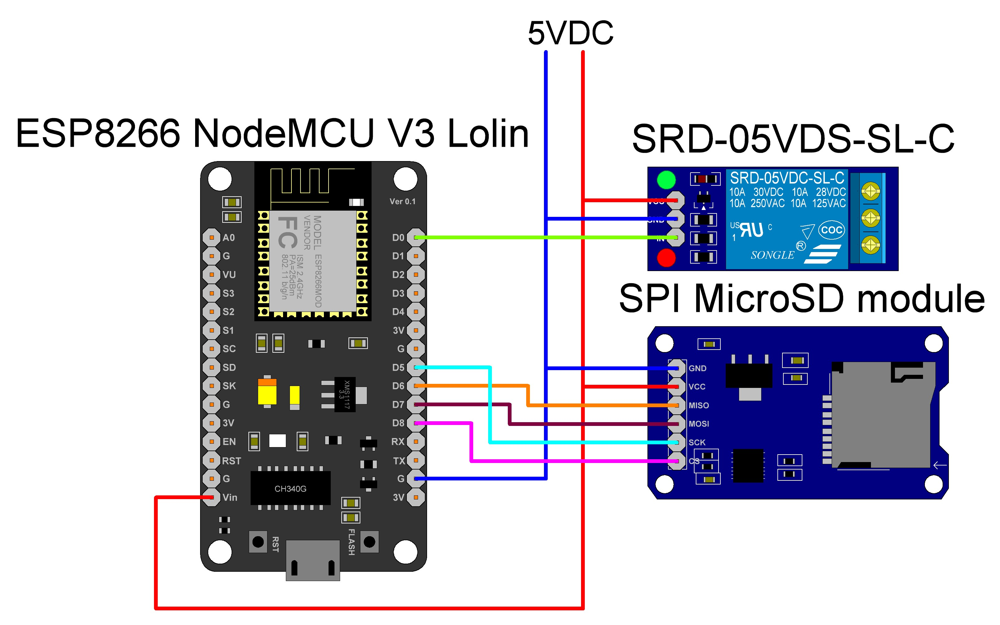

# Введение

**BAAS** - проект, придуманный для решения проблемы не вовремя подаваемых звонков. Полагаю все встречались с данной проблемой, когда ваша перемена становилась короче по вине вахтера. Данный проект решит эту проблему.

Идея была придумана [EasyAmper](https://github.com/EasyAmper)'ом. Я ([Darth Kuli](https://github.com/DarthVader904)) же первым довел её до ума.

# О функционале

Функционал прост - это подача звонков вовремя.

Чтобы это достичь был взят контроллер с возможностью соединения с интернетом, что позволит брать актуальное время. Если же соединение будет потеряно, то контроллер продолжет считать в оффлайне. А для хранения звонеов была взята CD карта, где храниться файл `call.json`.

Помимо этого, для удобства было написано веб приложение, для редактирования `call.json`.

# Реализация

Необходимые элементы:

* контроллер на базе esp8266;
* реле на 5v включающиеся по низкому уровню;
* SPI карт-ридер для SD карт;
* прямые руки.

Схема подключения.

